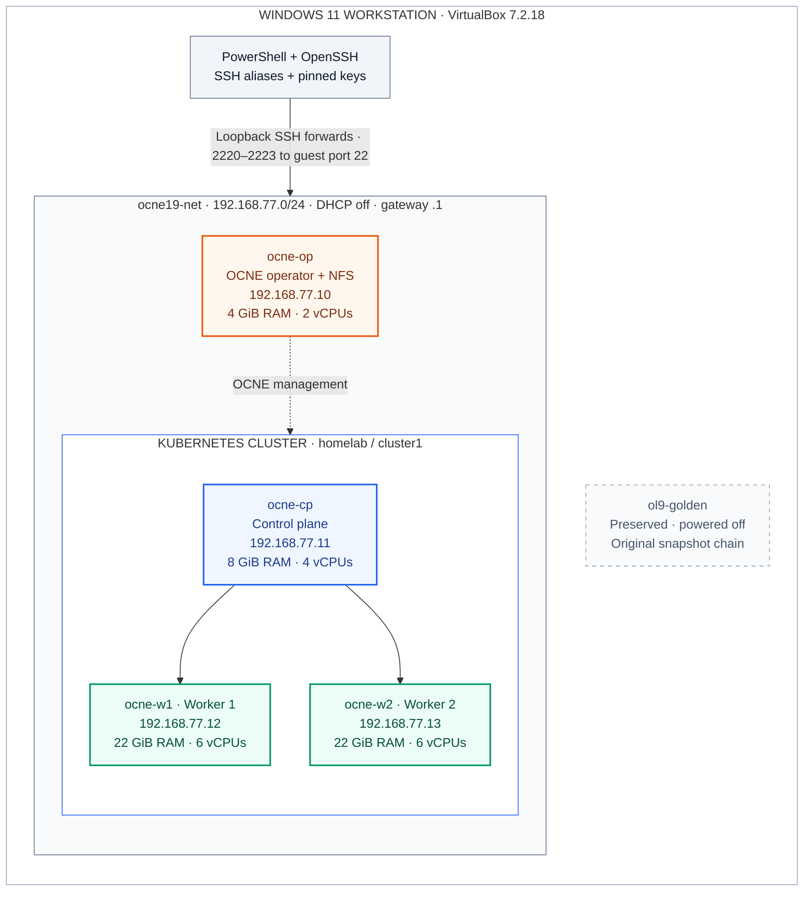
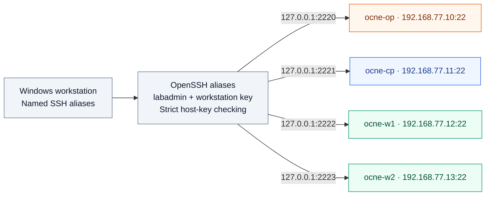
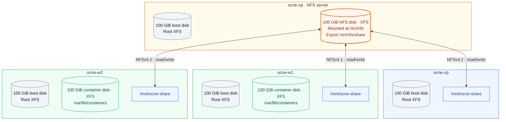

# Lab architecture and data paths

The diagrams show the **completed OCNE 1.9 foundation**, based on the verified 1 October 2026 run and the checked-in configuration. Added on 8 October; no fresh VM health check is implied. GitHub renders the Mermaid blocks as diagrams.

## VM and cluster layout

The separate OCNE operator manages the platform and hosts NFS. It is not a Kubernetes node and is not the Oracle Database Operator. The Kubernetes cluster contains one control-plane node and two workers; its default pod network is Flannel.

All four clones run Oracle Linux 9.8 / UEK R7. Recorded platform versions: OCNE 1.9.6, Kubernetes v1.29.14+2.el9 and CRI-O 1.29.1. New clone VM files and disks are under D:\OCNE19-Lab\vms. The golden VM remains in its original location with its original snapshot chain.

Colors identify roles: orange for the operator, blue for control plane, green for workers, gray for workstation/source. Solid control-plane arrows and dashed OCNE arrows show logical management relationships, not one-way network rules or a complete service-port inventory.

## How Windows SSH reaches the VMs

Windows hosts entries resolve each short name and .lab.test FQDN to its actual 192.168.77.x guest address. OpenSSH then uses the alias configuration to connect through the matching loopback forward. Hosts entries alone do not give Windows a direct route into the NAT guest subnet or expose other services.

Inside the lab, guests reach each other directly at their 192.168.77.x addresses. Password-free labadmin SSH was verified for every guest pair, using each guest's own private key and distributed public keys. Sudo remains password-required. This mesh is omitted from the diagram to keep the Windows access path readable.

The shared NAT network provides outbound connectivity via 192.168.77.1; node-to-node traffic stays on the shared guest network. No separate external database access route is configured.

Configuration: [lab.psd1](../config/lab.psd1), [Windows SSH aliases](../config/windows-ssh.conf). Operational details: [SSH access](SSH-ACCESS.md).

## Disks and shared files

Each cylinder is a separate VDI. The four boot disks are independent full clones, enlarged to 100 GiB each; the mounted root XFS filesystem is approximately 99 GiB and includes /var. Each worker's additional 100 GiB container disk is private to that worker.

The operator's additional 100 GiB NFS disk supplies **one shared capacity**, mounted locally at /srv/nfs. The operator accesses /srv/nfs/share directly; the three clients mount that same export at /mnt/ocne-share using NFSv4.1. Bidirectional arrows represent file reads/writes.

NFS access uses labadmin UID/GID 1001, directory mode 0770 and root squashing. SELinux remains Enforcing. The seven clone disks total **700 GiB virtual capacity**, excluding the golden VM and snapshots; dynamic VDI consumption varies.

This is host-level NFS. No Kubernetes PV/PVC, storage provisioner or shared ASM block devices are part of the completed foundation. The independent worker container disks must not be treated as shared RAC disks.

## Operational boundaries

| Area | Recorded configuration |
|---|---|
| Host resources | 61.66 GiB visible RAM; 28 logical processors |
| VM allocation | 56 GiB RAM and 18 vCPUs total; workers remain 22 GiB each |
| Memory exception | Operator 4 GiB / control plane 8 GiB remain below Oracle's published minimums; successful base-lab checks do not establish RAC capacity |
| Startup | Operator first; verify NFS filesystem/export, then start control plane and workers |
| Shutdown | Workers/control plane off before operator |
| Availability | Single Windows host and single control plane; NFS depends on the operator |
| Preserved source | ol9-golden stays powered off during normal lab operation |
| Next phase | Database Operator, Multus/private interconnects, shared ASM storage and RAC remain separate, paused work |

Return to [Operating the lab](OPERATING-LAB.md) for commands and checks, or [the detailed run log](CLONING-RUN-LOG.md) for evidence. The [installation guide](OCNE-1.9-OL9-Setup-Guide.md) retains the Oracle sources and original procedure. These diagrams document this lab's local Windows/VirtualBox implementation, not an Oracle certification statement.

## Editing the diagrams

Edit the Mermaid blocks in this file and the overview in [README](../README.md). Keep the overview copies identical. Reconcile names, addresses and allocations against the non-secret config, and disk/service facts against the run log. Do not draw planned RAC components as already installed.
